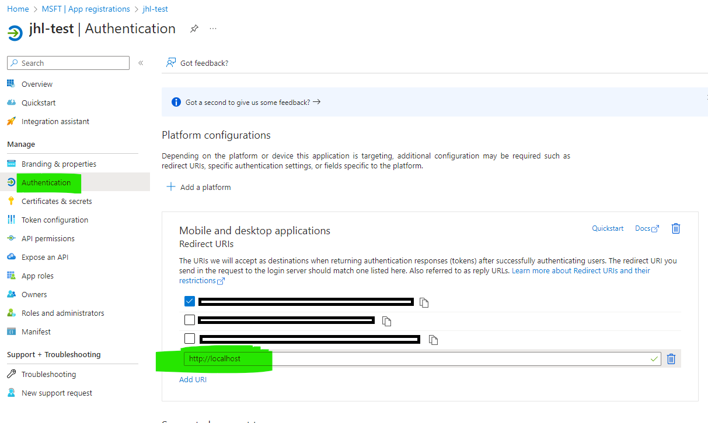
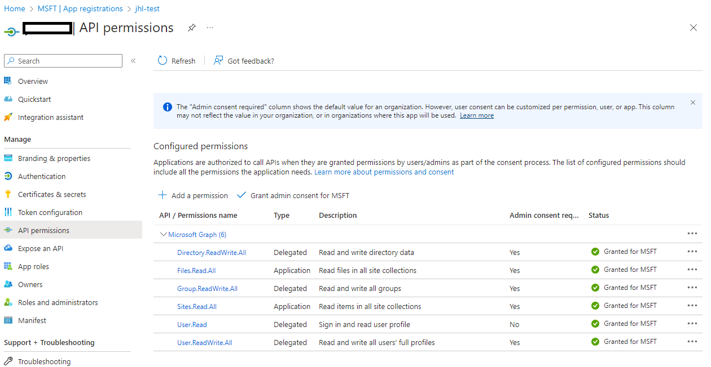

Sample app to generate search index for Azure AI Search
============

this console app will generate an index on Azure AI Search Service, using Sharepoint document library\
**please note that this is modified  / trimmed code from author of this git repo**\
https://github.com/subhasishmukhopadhyay2018/democode/tree/main/AzureOpenAI

Before Starting
------------

there are some preparation
1. Install dotnet 6.0 runtime\
    https://dotnet.microsoft.com/en-us/download/dotnet/6.0/runtime?cid=getdotnetcore&os=windows&arch=x64

2. Allow Entra ID App to redirect to localhost\
    

3. Grant Access to the Entra ID APP\
    

4. **appsettings.json** must be filled in correctly

    * ClientId : `Client Id of Entra ID App`
    * TenantId : `Tenant Id of the Entra Id App`
    * SiteId : `Site Id of the Sharepoint`
        * this can be found using Graph API call
        * https://learn.microsoft.com/en-us/graph/api/site-get?view=graph-rest-1.0&tabs=http
    * DriveId : Document Library Id Of the Sharepoint Site
        * this can be found using Graph API Call
        * https://learn.microsoft.com/en-us/graph/api/drive-list?view=graph-rest-1.0&tabs=http#list-a-sites-drives
    * GraphScope : `https://graph.microsoft.com/.default`
    * DeploymentName :  `Azure AI Search Deployment Name`
    * ACSSearchIndex : `Azure AI Search Index Name`
    * ACSSearchEndpoint : `Azure AI Search Endpoint`
    * ACSSearchKey : `Azure AI Search Key`

5. Go to **/Helper/AzureSearchIndexHelper.cs** and Modify line 116\
    with the desired Group Id for this Index.\
    *please keep in mind that additional REST call to grab sharepoint permissions can be done via Graph API as well*\
    https://learn.microsoft.com/en-us/graph/api/site-list-permissions?view=graph-rest-1.0&tabs=http
    ~~~csharp
    ...
        // sample AAD groups GUID for security trimming
        AAD_GROUPS = new string[] { "<GROUP ID 1>", "<GROUP ID 2>" }
    ...
    ~~~

Running the App
------------
* to run the app
~~~
dotnet run
~~~

* to create the index press *y* and hit enter
~~~
Would you like to create or update index (y/n)? y
~~~

* when index is created successfully it should show this message
~~~
Successfully created/updated Azure Cognitive Search Index: <SEARCH INDEX NAME> in https://<SEACH ID TEXT>.search.windows.net/
~~~

* update the index with the files exists in the sharepoint site next\
this command will open a browser to do authentication to allow app to connect to sharepoint.
~~~
Would you like to create or update index data (y/n)? y
~~~

* after index has been created, you can now query the Azure AI Search Index

&nbsp;

For simplicity the current sample code will only index PDF files\
you can extend this by adding more file reader related code to the **Program.cs**
~~~csharp
...
    Stream streamContent = await fileContent.ReadAsStreamAsync();
    PdfReader reader = new PdfReader(streamContent);
...
~~~

&nbsp;
___
please note that this code sample is generated using\
https://github.com/subhasishmukhopadhyay2018/democode/tree/main/AzureOpenAI

To take a look at in more detail please refer to the article below\
https://www.linkedin.com/pulse/chat-sharepoint-documents-using-azure-openai-search-mukhopadhyay-txyrc/